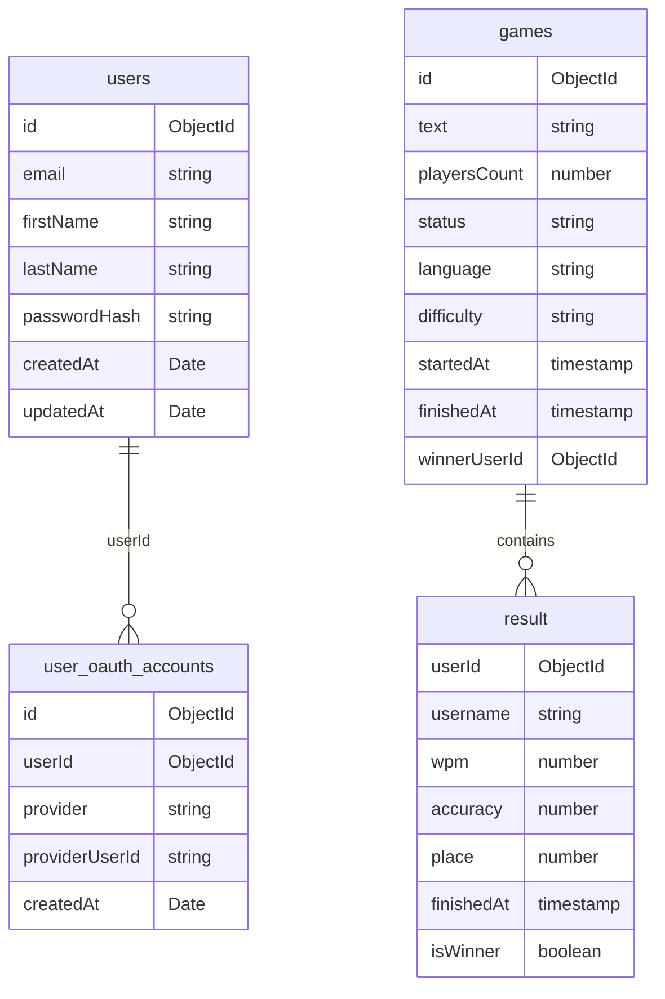

# Typing race:

## ℹ️ General Info

This is a web application for training typing speed and accuracy in a racing format.

## 🏭 Applications

- [Backend](./backend) — Application's backend.

    _To work properly, fill in the **`.env`** file. Use the **`.env.example`** file as an example._

- [Frontend](./frontend) — Application's frontend.

    _To work properly, fill in the **`.env`** file. Use the **`.env.example`** file as an example._

- [Shared](./shared) — Application's common modules for reuse.

## 🖍 Requirements

- [NodeJS](https://nodejs.org/en/) (22.x.x);
- [NPM](https://www.npmjs.com/) (10.x.x);
- run **`npx simple-git-hooks`** at the root of the project, before the start (it will set
  the [pre-commit hook](https://www.npmjs.com/package/simple-git-hooks) for any commits).

## How to run:

- `npm install` _at root_
- `docker compose up --build` _to run backend_
- `cd frontend && npm run dev` \_to run frontend

## Database Schema:



## 📁 Architecture

```bash
src/
 ├─ features/
 │   ├─ users/
 │   │   ├─ model.ts
 │   │   ├─ service.ts
 │   │   ├─ controller.ts
 │   │   └─ types.ts
 │   ├─ auth/
 │   │   ├─ auth.ts
 │   │   └─ types.ts
 │   └─ posts/
 │       ├─ model.ts
 │       ├─ service.ts
 │       └─ types.ts
 ├─ libs/  # logger, db, config
 └─ index.ts
```

## 🧑‍💻 CI

### 🗞 Git

#### 🏅 Pull Request flow

```
<type>: <ticket-title> <project-prefix>-<issue-number>
```

For the full list of types check [Conventional Commits](https://github.com/conventional-changelog/commitlint/tree/master/%40commitlint/config-conventional)

##### Example

- `feat: add dashboard screen ir-20`

#### 🌳 Branch flow

```
<issue-number>-<type>-<short-desc>
```

##### Examples

- `14-feat-add-dashboard`
- `12-feat-add-user-flow`
- `34-fix-user-flow`

#### 🗂 Commit flow

We use [Conventional Commits](https://www.conventionalcommits.org/en/v1.0.0/) to handle commit messages

```
<type>: <description> <project-prefix>-<issue-number>
```

##### Examples

- `feat: add dashboard component ir-15`
- `fix: update dashboard card size ir-42`

## 📦 CD

[Handled](.github/workflows/cd.yml) by [GitHub Actions](https://docs.github.com/en/actions).
